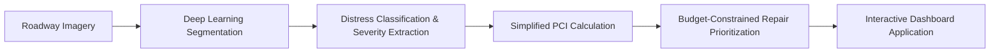

# road-pci-intelligence

An end-to-end deep learning and decision-support system designed to automate road distress detection, calculate pavement health metrics, and optimize infrastructure maintenance. Manual road pavement inspection is dangerous, subjective, and difficult to scale across municipal networks. By leveraging deep semantic segmentation to identify and quantify critical distress categories (longitudinal cracks, transverse cracks, alligator cracking, and potholes) from roadway imagery, this system computes an automated, simplified Pavement Condition Index (PCI) score and runs budget-constrained repair prioritization simulations to help municipal planners allocate road maintenance funds effectively.

---

## Planned Pipeline



1. **Data Ingestion & Preprocessing**: Sourcing, exploring, and unifying pavement distress benchmarks with pixel-level segmentation masks and multi-class annotations.
2. **Deep Semantic Segmentation**: Training deep segmentation networks (e.g., U-Net / Feature Pyramid Networks via `segmentation-models-pytorch`) to classify distress types (longitudinal, transverse, alligator cracks, potholes).
3. **Pavement Condition Index (PCI) Engine**: Measuring defect density and severity from predicted masks to formulate an objective, simplified PCI score (0–100 scale).
4. **Maintenance Optimization Simulation**: Formulating budget-constrained resource allocation algorithms (greedy heuristic & linear programming) to prioritize street repairs for maximum network condition improvement.
5. **Interactive Dashboard**: A Streamlit web application enabling users to upload inspection imagery, view segmentation overlays, inspect distress metrics, and simulate maintenance budgets.

---

## Status Checklist

- [x] **Environment & Tooling Verification** (Python 3.14, Git, Kaggle CLI, GitHub CLI authenticated)
- [x] **Project Scaffolding & Version Control** (Directory structure, requirements, git initialization, GitHub repository)
- [x] **Dataset Discovery & Selection** (Selected `pothole-image-segmentation-dataset`, `road-crack-dataset`, `crack500`, and `rdd2022es`)
- [x] **Step 1: Data Exploration & Schema Audit** *(Done)*:
  - Kaggle Notebook: [`vedshah04/road-pci-intelligence-data-exploration`](https://www.kaggle.com/code/vedshah04/road-pci-intelligence-data-exploration) ([`notebooks/01_data_exploration/`](notebooks/01_data_exploration/))
  - Directory tree audit, resolution stats, mask value distributions, duplication & base-ID leakage checks.
- [x] **Step 2: Manifests, Mask Standardization & Metric Reconciliation** *(Done)*:
  - Kaggle Notebooks:
    - Manifests & Segmentation Reconciliation: [`vedshah04/road-pci-intelligence-manifests-and-loader`](https://www.kaggle.com/code/vedshah04/road-pci-intelligence-manifests-and-loader) ([`notebooks/02_manifest_and_loader/`](notebooks/02_manifest_and_loader/))
    - Parallel RDD Manifest Builder: [`vedshah04/road-pci-intelligence-rdd-manifest-builder`](https://www.kaggle.com/code/vedshah04/road-pci-intelligence-rdd-manifest-builder) ([`notebooks/03_build_rdd_manifest/`](notebooks/03_build_rdd_manifest/))
  - Unified CSV manifests in `manifests/` with relative paths (`pothole`, `road_crack`, `crack500`, `rdd2022es`).
  - Standardized mask conversions & documented assumptions (`src/data_rules.py`).
  - Leak-proof group partitioning (pothole `pic-<N>`, road-crack scene 70/15/15, RDD2022ES mirror pairing).
  - Validation test suite (`tests/test_manifest.py`) passing 100% on Kaggle.
  - Rigorous ground-truth foreground metric reconciliation across all 1,686 masks.
  - Comprehensive documentation in [`docs/data_decisions.md`](docs/data_decisions.md).
- [x] **Step 3A: Training Pipeline, Sanity Checks & Smoke Test** *(In Progress)*:
  - Kaggle Notebook: [`vedshah04/road-pci-intelligence-train-baseline`](https://www.kaggle.com/code/vedshah04/road-pci-intelligence-train-baseline) ([`notebooks/04_train_baseline/`](notebooks/04_train_baseline/))
  - Pretrained U-Net (ResNet-34 ImageNet weights, `segmentation-models-pytorch`) with 2 independent sigmoid outputs `[crack, pothole]`.
  - Custom `MaskedMultiTaskLoss` (BCE + Soft Dice) with selective gradient masking for un-supervised channels.
  - `SourceBalancedSampler` drawing 600 samples/epoch (200 crack500, 200 road_crack, 200 pothole).
  - Full image eval with 32-multiple padding and unpadding.
  - Rigorous sanity checks: loss unit tests, 8-sample overfit test (Dice > 0.85), 3-epoch smoke test, and validation overlays.
- [ ] **Step 3B: Full Deep Semantic Segmentation Training & Convergence** (Extended epochs, learning rate tuning, best checkpoint tracking)
- [ ] **Step 4: Automated PCI Computation Module** (Severity deduction curves from predicted mask areas)
- [ ] **Step 5: Budget-Constrained Optimization Engine** (Knapsack / priority repair simulations)
- [ ] **Step 6: Interactive Streamlit Web Application** (Distress overlay inspector & budget scenario planner)

---

## Project Structure

```
road-pci-intelligence/
├── app/                  # Streamlit application UI and components
├── data/                 # Raw and processed datasets (git-ignored)
├── docs/                 # Architectural documentation & data decisions
├── manifests/            # Version-controlled CSV manifests for training & validation
├── notebooks/            # Isolated Jupyter/Kaggle notebook modules:
│   ├── 01_data_exploration/     # Exploratory analysis notebook & metadata
│   ├── 02_manifest_and_loader/  # Manifest builder & reconciliation notebook & metadata
│   ├── 03_build_rdd_manifest/   # 16-worker parallel RDD manifest builder & metadata
│   └── 04_train_baseline/       # Training pipeline, sanity checks & smoke test
├── outputs/              # Model checkpoints, evaluation plots, and reports (git-ignored)
├── src/                  # Core modular source code (rules, builders, models, PCI)
├── tests/                # Automated unit test suite (manifest validation & leak checks)
├── .gitignore            # Git ignore configuration
├── README.md             # Project overview and roadmap
└── requirements.txt      # Project Python dependencies
```
